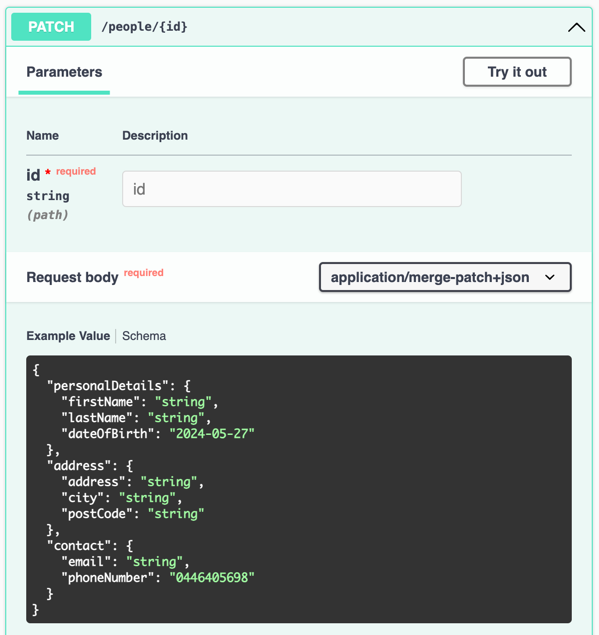

# PATCH API with Json Merge Patch

### Context
Usually a request for a PUT / POST API contains some annotations like `@NotBlank`, `@NotNull`, `@Valid`, etc 
so that our request body gets validated automatically by Spring, for example.

In the context of a PATCH API:
- not provide the field means keep the field as is.
- provide the field as null means remove the field.

Using a normal json and checking in the class that represents our request if the field is null doesn't work as we don't know
if the field is null because the front-end explicitly provided it as `null` (meaning remove the field) or if it's just because the field was not provided at all, 
as all fields not provided will be automatically mapped as null in the class that represents our request.

**Example:** let's say the class that represents our request is called `MyRequest`
```java
public record MyRequest(String name, LocalDate dateOfBirth) {
}
```

and the request body is something like
```json
{
  "name": "John Smith",
  "dateOfBirth": null
}
```
or
```json
{
  "name": "John Smith"
}
```

Doing `myRequest.dateOfBirth() == null` doesn't work. In both cases they will be null: 
in the first case, it was explicitly provided as `null`.
In the second case, it's `null` just because the field was not provided.


That said, the solution is to use `JsonMergePatch` as our request body, but there is a problem: we can't add (jakarta/javax) annotations to it, 
so the request body won't be automatically validated by Spring  

`@Valid @RequestBody JsonMergePatch request` doesn't work.

This example works around this issue, showing how to make use of the (jakarta/javax) annotations to validate a Json Merge Patch so that 
the request body is correctly validated as if we were using a POST / PUT API.

Check:
- [PersonController](src/main/java/com/github/elgleidson/patch/controller/PersonController.java)
- [DomainMerger](src/main/java/com/github/elgleidson/patch/controller/converter/DomainMerger.java)


## Swagger docs:

http://localhost:8080/swagger-ui.html

We can see the swagger docs are generated correctly. This is possible due to the following annotation:
`@Schema(implementation = PersonRequest.class) @RequestBody JsonMergePatch request`



## Testing with cURL

### Step 1: create a person only with personal details:
```shell
curl -X 'POST' \
  'http://localhost:8080/people' \
  -H 'accept: */*' \
  -H 'Content-Type: application/json' \
  -d '{
  "personalDetails": {
    "firstName": "Freddy",
    "lastName": "Krueger",
    "dateOfBirth": "1984-11-09"
  }
}'
```
_Response_: `794b32b2-b187-47b3-9b65-62014acc332a`

**Check the result:**
```shell
curl -X 'GET' 'http://localhost:8080/people/794b32b2-b187-47b3-9b65-62014acc332a'
```
_Response:_
```json
{
  "id": "794b32b2-b187-47b3-9b65-62014acc332a",
  "personalDetails": {
    "firstName": "Freddy",
    "lastName": "Krueger",
    "dateOfBirth": "1984-11-09"
  },
  "address": null,
  "contact": null
}
```


### Adding address:
```shell
curl -X 'PATCH' \
  'http://localhost:8080/people/794b32b2-b187-47b3-9b65-62014acc332a' \
  -H 'accept: */*' \
  -H 'Content-Type: application/merge-patch+json' \
  -d '{
  "address": {
    "address": "1428 Elm Street",
    "city": "Los Angeles",
    "postCode": "LA1234"
  }
}
'
```
_Response:_
```json
{
  "id": "794b32b2-b187-47b3-9b65-62014acc332a",
  "personalDetails": {
    "firstName": "Freddy",
    "lastName": "Krueger",
    "dateOfBirth": "1984-11-09"
  },
  "address": {
    "address": "1428 Elm Street",
    "city": "Los Angeles",
    "postCode": "LA1234"
  },
  "contact": null
}
```


### Adding contact details
```shell
curl -X 'PATCH' \
  'http://localhost:8080/people/794b32b2-b187-47b3-9b65-62014acc332a' \
  -H 'accept: */*' \
  -H 'Content-Type: application/merge-patch+json' \
  -d '{
  "contact": {
    "email": "freddy.krueger@nightmare.com",
    "phoneNumber": "12345678"
  }
}
'
```
_Response:_
```json
{
  "id": "794b32b2-b187-47b3-9b65-62014acc332a",
  "personalDetails": {
    "firstName": "Freddy",
    "lastName": "Krueger",
    "dateOfBirth": "1984-11-09"
  },
  "address": {
    "address": "1428 Elm Street",
    "city": "Los Angeles",
    "postCode": "LA1234"
  },
  "contact": {
    "email": "freddy.krueger@nightmare.com",
    "phoneNumber": "12345678"
  }
}
```


### Removing all contact details
```shell
curl -X 'PATCH' \
  'http://localhost:8080/people/794b32b2-b187-47b3-9b65-62014acc332a' \
  -H 'accept: */*' \
  -H 'Content-Type: application/merge-patch+json' \
  -d '{
  "contact": null
}
'
```
_Response:_
```json
{
  "id": "794b32b2-b187-47b3-9b65-62014acc332a",
  "personalDetails": {
    "firstName": "Freddy",
    "lastName": "Krueger",
    "dateOfBirth": "1984-11-09"
  },
  "address": {
    "address": "1428 Elm Street",
    "city": "Los Angeles",
    "postCode": "LA1234"
  },
  "contact": null
}
```


## Updating only the city
```shell
curl -X 'PATCH' \
  'http://localhost:8080/people/794b32b2-b187-47b3-9b65-62014acc332a' \
  -H 'accept: */*' \
  -H 'Content-Type: application/merge-patch+json' \
  -d '{
  "address": {
    "city": "New York"
  }
}
'
```
_Response:_
```json
{
  "id": "794b32b2-b187-47b3-9b65-62014acc332a",
  "personalDetails": {
    "firstName": "Freddy",
    "lastName": "Krueger",
    "dateOfBirth": "1984-11-09"
  },
  "address": {
    "address": "1428 Elm Street",
    "city": "New York",
    "postCode": "LA1234"
  },
  "contact": null
}
```


### Adding invalid field
```shell
curl -X 'PATCH' \
  'http://localhost:8080/people/794b32b2-b187-47b3-9b65-62014acc332a' \
  -H 'accept: */*' \
  -H 'Content-Type: application/merge-patch+json' \
  -d '{
  "contact": {
    "email": "invalid_email"
  }
}
'
```
_Response:_ 400 as it gets validated by `@Email` annotation.


### Removing optional field
```shell
curl -X 'PATCH' \
  'http://localhost:8080/people/794b32b2-b187-47b3-9b65-62014acc332a' \
  -H 'accept: */*' \
  -H 'Content-Type: application/merge-patch+json' \
  -d '{
  "contact": {
    "email": null
  }
}'
```
_Response:_
```json
{
  "id": "794b32b2-b187-47b3-9b65-62014acc332a",
  "personalDetails": {
    "firstName": "Freddy",
    "lastName": "Krueger",
    "dateOfBirth": "1984-11-09"
  },
  "address": {
    "address": "1428 Elm Street",
    "city": "Los Angeles",
    "postCode": "LA1234"
  },
  "contact": {
    "email": null,
    "phoneNumber": "12345678"
  }
}
```


### Removing mandatory field
```shell
curl -X 'PATCH' \
  'http://localhost:8080/people/794b32b2-b187-47b3-9b65-62014acc332a' \
  -H 'accept: */*' \
  -H 'Content-Type: application/merge-patch+json' \
  -d '{
  "personalDetails": {
    "firstName": null
  }
}'
```
_Response:_ 400 as it gets validated by `@NotBlank` annotation.