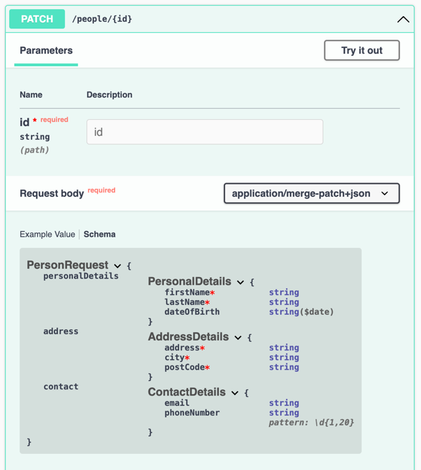

# PATCH API with Json Merge Patch

Usually a request for a PUT / POST API contains some annotations like `@NotBlank`, `@NotNull`, `@Valid`, etc. 
However, when using `JsonMergePatch` our request body is not validated automatically by Spring.

`@Valid @RequestBody JsonMergePatch request` doesn't work.

This example works around this issue, showing how to make use of the (jakarta/javax) annotations to validate a Json Merge Patch.


## Swagger docs:

http://localhost:8080/swagger-ui.html

We can see the swagger docs are generated correctly. This is possible due to the following annotation:
`@Schema(implementation = PersonRequest.class) @RequestBody JsonMergePatch request`



## Testing with cURL

### Step 1: create a person only with personal details:
```shell
curl -X 'POST' \
  'http://localhost:8080/people' \
  -H 'accept: */*' \
  -H 'Content-Type: application/json' \
  -d '{
  "personalDetails": {
    "firstName": "Freddy",
    "lastName": "Krueger",
    "dateOfBirth": "1984-11-09"
  }
}'
```
_Response_: `794b32b2-b187-47b3-9b65-62014acc332a`

**Check the result:**
```shell
curl -X 'GET' 'http://localhost:8080/people/794b32b2-b187-47b3-9b65-62014acc332a'
```
_Response:_
```json
{
  "id": "794b32b2-b187-47b3-9b65-62014acc332a",
  "personalDetails": {
    "firstName": "Freddy",
    "lastName": "Krueger",
    "dateOfBirth": "1984-11-09"
  },
  "address": null,
  "contact": null
}
```


### Adding address:
```shell
curl -X 'PATCH' \
  'http://localhost:8080/people/794b32b2-b187-47b3-9b65-62014acc332a' \
  -H 'accept: */*' \
  -H 'Content-Type: application/merge-patch+json' \
  -d '{
  "address": {
    "address": "1428 Elm Street",
    "city": "Los Angeles",
    "postCode": "LA1234"
  }
}
'
```
_Response:_
```json
{
  "id": "794b32b2-b187-47b3-9b65-62014acc332a",
  "personalDetails": {
    "firstName": "Freddy",
    "lastName": "Krueger",
    "dateOfBirth": "1984-11-09"
  },
  "address": {
    "address": "1428 Elm Street",
    "city": "Los Angeles",
    "postCode": "LA1234"
  },
  "contact": null
}
```


### Adding contact details
```shell
curl -X 'PATCH' \
  'http://localhost:8080/people/794b32b2-b187-47b3-9b65-62014acc332a' \
  -H 'accept: */*' \
  -H 'Content-Type: application/merge-patch+json' \
  -d '{
  "contact": {
    "email": "freddy.krueger@nightmare.com",
    "phoneNumber": "12345678"
  }
}
'
```
_Response:_
```json
{
  "id": "794b32b2-b187-47b3-9b65-62014acc332a",
  "personalDetails": {
    "firstName": "Freddy",
    "lastName": "Krueger",
    "dateOfBirth": "1984-11-09"
  },
  "address": {
    "address": "1428 Elm Street",
    "city": "Los Angeles",
    "postCode": "LA1234"
  },
  "contact": {
    "email": "freddy.krueger@nightmare.com",
    "phoneNumber": "12345678"
  }
}
```


### Removing all contact details
```shell
curl -X 'PATCH' \
  'http://localhost:8080/people/794b32b2-b187-47b3-9b65-62014acc332a' \
  -H 'accept: */*' \
  -H 'Content-Type: application/merge-patch+json' \
  -d '{
  "contact": null
}
'
```
_Response:_
```json
{
  "id": "794b32b2-b187-47b3-9b65-62014acc332a",
  "personalDetails": {
    "firstName": "Freddy",
    "lastName": "Krueger",
    "dateOfBirth": "1984-11-09"
  },
  "address": {
    "address": "1428 Elm Street",
    "city": "Los Angeles",
    "postCode": "LA1234"
  },
  "contact": null
}
```


## Updating only the city
```shell
curl -X 'PATCH' \
  'http://localhost:8080/people/794b32b2-b187-47b3-9b65-62014acc332a' \
  -H 'accept: */*' \
  -H 'Content-Type: application/merge-patch+json' \
  -d '{
  "address": {
    "city": "New York"
  }
}
'
```
_Response:_
```json
{
  "id": "794b32b2-b187-47b3-9b65-62014acc332a",
  "personalDetails": {
    "firstName": "Freddy",
    "lastName": "Krueger",
    "dateOfBirth": "1984-11-09"
  },
  "address": {
    "address": "1428 Elm Street",
    "city": "New York",
    "postCode": "LA1234"
  },
  "contact": null
}
```


### Adding invalid field
```shell
curl -X 'PATCH' \
  'http://localhost:8080/people/794b32b2-b187-47b3-9b65-62014acc332a' \
  -H 'accept: */*' \
  -H 'Content-Type: application/merge-patch+json' \
  -d '{
  "contact": {
    "email": "invalid_email"
  }
}
'
```
_Response:_ 400 as it gets validated by `@Email` annotation.


### Removing optional field
```shell
curl -X 'PATCH' \
  'http://localhost:8080/people/794b32b2-b187-47b3-9b65-62014acc332a' \
  -H 'accept: */*' \
  -H 'Content-Type: application/merge-patch+json' \
  -d '{
  "contact": {
    "email": null
  }
}'
```
_Response:_
```json
{
  "id": "794b32b2-b187-47b3-9b65-62014acc332a",
  "personalDetails": {
    "firstName": "Freddy",
    "lastName": "Krueger",
    "dateOfBirth": "1984-11-09"
  },
  "address": {
    "address": "1428 Elm Street",
    "city": "Los Angeles",
    "postCode": "LA1234"
  },
  "contact": {
    "email": null,
    "phoneNumber": "12345678"
  }
}
```


### Removing mandatory field
```shell
curl -X 'PATCH' \
  'http://localhost:8080/people/794b32b2-b187-47b3-9b65-62014acc332a' \
  -H 'accept: */*' \
  -H 'Content-Type: application/merge-patch+json' \
  -d '{
  "personalDetails": {
    "firstName": null
  }
}'
```
_Response:_ 400 as it gets validated by `@NotBlank` annotation.